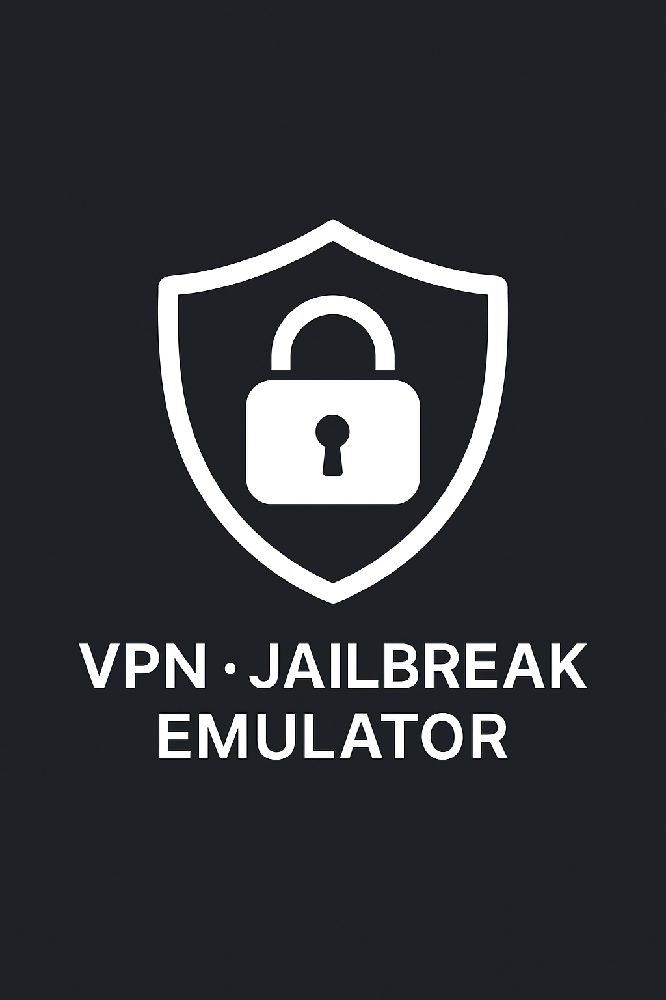

# rn-ios-check-vpn-emu-jb-manu


React Native module to check **VPN**, **Jailbreak**, and **Emulator/Simulator** status on iOS devices.

<p align="center">
  
</p>

## 🚀 Installation
```sh
npm install rn-ios-check-vpn-emu-jb-manu
cd ios && pod install
```

## 🧪 Usage
```ts
import { getSecurityStatus } from 'rn-ios-check-vpn-emu-jb-manu';

const checkSecurity = async () => {
  const status = await getSecurityStatus();
  console.log('Security Status:', status);

  /*
    Example output:
    {
      isVpnActive: false,
      isJailBroken: false,
      isDebugOrSimulator: true
    }
  */
};
```

### 📱 Alert example
```ts
import { Alert } from 'react-native';

Alert.alert('Security Check', JSON.stringify(status, null, 2));
```

### 📋 Pretty display example
```ts
const statusText = `
🔐 Jailbroken: ${status.isJailBroken ? 'Yes 🚨' : 'No ✅'}
🛡️ VPN Active: ${status.isVpnActive ? 'Yes 🔒' : 'No'}
🧪 Simulator: ${status.isDebugOrSimulator ? 'Yes 🧱' : 'No'}
`;

Alert.alert('Device Security', statusText);
```

## 🔗 Development Testing
You can test locally before publishing:

### Link into another project
```sh
cd rn-ios-check-vpn-emu-jb-manu
npm link

cd your-other-project
npm link rn-ios-check-vpn-emu-jb-manu
cd ios && pod install
```
## 🧩 Supported
- ✅ iOS 12+
- ✅ React Native 0.70+

## 📓 Changelog
See [CHANGELOG.md](https://github.com/manurung9/rn-ios-check-vpn-emu-jb-manu/blob/main/CHANGELOG.md) for details.

## License
MIT

---

Enjoy using this library! Feel free to submit issues or pull requests 🙌 
MANTAP
